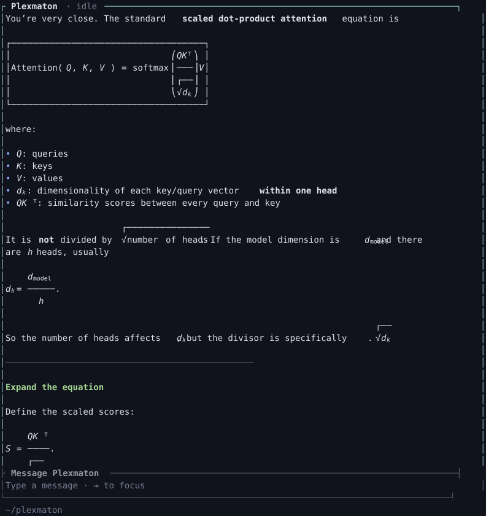

<div align="center">

# Plexmaton

**AI coding, clearly in view.**

[](https://github.com/appautomaton/plexmaton/actions/workflows/ci.yml)
[](rust-toolchain.toml)
[](.agents/roadmap.md)
[](https://appautomaton.renocrypt.com/)

</div>

Plexmaton is an AI coding assistant for the terminal, built in Rust by App Automaton. Choose your model, follow the work, and return to saved conversations.

## Why Plexmaton?

- **Keep the work in view.** Streaming answers, tool activity and approvals share a responsive workspace with expandable details.
- **Choose your models.** Use OpenAI Responses, Chat Completions, Anthropic Messages or Gemini APIs.
- **Stay in control.** Approve an action once, remember a Session or Project permission, and review or revoke it in the Drawer.
- **Carry your context forward.** Saved conversations and automatic compaction preserve source history. Reusable `SKILL.md` instructions bring your workflows into the conversation.
- **Read comfortably.** Pastel Markdown and native math with hats and Chinese labels. Unfinished math stays compact; copy follows your selection.

<p align="center">

<br><sub>Workspace render preview. <a href=".agents/specs/math-layout.md">Native math support</a>.</sub>
</p>

## Get started

**macOS Apple Silicon** is the development target. Install the pinned Rust toolchain and `rg`.

```sh
git clone https://github.com/appautomaton/plexmaton.git
cd plexmaton
mkdir -p .local/plexmaton
cp examples/providers.toml .local/plexmaton/config.toml
```

Select your provider/model in that file, set its `api_key_env` variable, then launch:

```sh
PLEXMATON_HOME="$PWD/.local/plexmaton" cargo run -p plexmaton-cli --bin plexmaton
```

`/model` chooses a configured model for the open conversation while idle; new/resumed conversations
use your configured default. [Model selection](.agents/specs/model-selection.md).

[Configuration and effort](.agents/specs/provider-adapter.md#request-configuration)

Project guidance loads from `PLEXMATON_HOME/AGENTS.md` (default `~/.plexmaton/AGENTS.md`), then
`AGENTS.md` from the checkout root to your working directory. Opening a conversation refreshes
this snapshot; deeper files are read through ordinary tools. [Scope and limits](.agents/specs/agent-instructions.md).

UI, tools and journals are local; model requests use your configured endpoint. Commands are **not OS-sandboxed**. File tools stay within the workspace and refuse symlinks.

## Everyday controls

| Input | Action |
| --- | --- |
| `Ctrl-P` | Open the Drawer: configuration and permissions |
| `Ctrl-J`, `Shift-Enter`, `Alt-Enter` | Newline in conversation input |
| `Alt-↑` | Take the most recent waiting message into the empty primary composer |
| `Ctrl-C` | Clear a draft or interrupt its conversation |
| `Ctrl-D` twice within one second | Quit |
| `Esc` | Back out one layer |
| `1`–`3` | Choose an approval option while focused |
| Approval: `Ctrl-O` / command click | Inspect; `c` / ⧉ copy, `Esc` / × close |
| `$` | Find and complete a skill |
| `/` | Commands: `/new`, `/resume`, `/compact`, `/permissions`, `/effort`, `/model` |

Mouse movement and arrows share the focused menu choice. The Drawer’s bottom-center `︽` retracts it; `Esc` goes back one layer. Copy briefly shows `✓ Copied` after local acceptance or `Copy sent` after terminal delivery. Rate limits offer Retry and Edit & retry.

[Full key guide](.agents/specs/interaction-routing.md#key-grammar) · [Skills](.agents/specs/agent-skills.md) · [Selection and copy](.agents/specs/selection-and-copy.md) · [Optional status line](.agents/specs/status-line.md)

## History and development

Conversations save on the first message; blank launches save nothing. Use `--ephemeral` to opt out. Exit prints a resume command. Journal epochs `2026-09-04` and `2026-09-05` remain readable without rewriting history.

One live agent is available today. Multi-agent collaboration is on the [roadmap](.agents/roadmap.md). Linux compatibility is not yet established.

Use the [quality gates](.agents/standards/quality-gates.md) for local checks and CI coverage. Model fixtures stay local; private state goes in ignored `.local/`.

## More from App Automaton

[Website](https://appautomaton.renocrypt.com/) · [GitHub](https://github.com/appautomaton) · [Hugging Face](https://huggingface.co/appautomaton)

[pi-arcweld](https://github.com/appautomaton/pi-arcweld): a curated Pi coding workspace. [webmaton](https://github.com/appautomaton/webmaton): browser and web-research skills.
